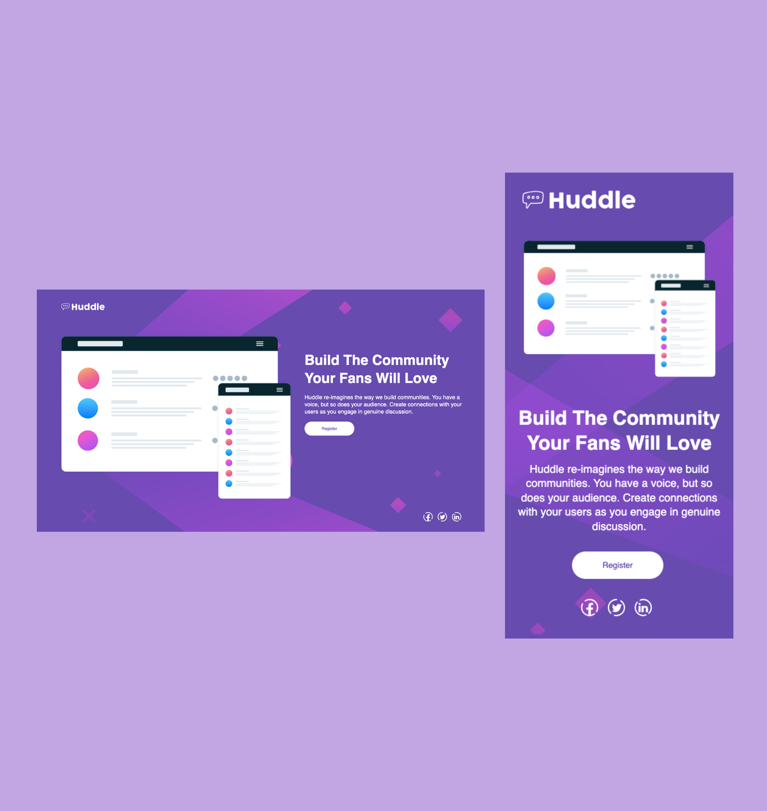

# Frontend Mentor - Huddle landing page with single introductory section solution

## Table of contents

- [Overview](#overview)
  - [The challenge](#the-challenge)
  - [Screenshot](#screenshot)
  - [Links](#links)
- [My process](#my-process)
  - [Built with](#built-with)
  - [What I learned](#what-i-learned)
  - [Continued development](#continued-development)
  - [Useful resources](#useful-resources)
- [Author](#author)
- [Acknowledgments](#acknowledgments)

## Overview

### The challenge

Users should be able to:

- View the optimal layout for the page depending on their device's screen size
- See hover states for all interactive elements on the page

### Screenshot




### Links

- Solution URL: [Check out my solution](https://www.frontendmentor.io/solutions/hover-animation-using-pseudoclass-selector-responsive-mobile-design-JGBxEyAuDE)
- Live Site URL: [Check out my live site](https://omowunmikamil.github.io/huddle_landing_page.github.io/)

## My process

### Built with

- Semantic HTML5 markup
- CSS custom properties
- Flexbox
- Mobile-first workflow (Mobile Responsive)

### What I learned


```html
<h1>Some HTML code I'm proud of</h1>
<a href="https://www.facebook.com/BrowserNerd"><svg xmlns="http://www.w3.org/2000/svg" x="0px" y="0px" width="36" height="36" viewBox="0,0,256,256">
  <g fill="none" fill-rule="nonzero" stroke="none" stroke-width="none" stroke-linecap="none" stroke-linejoin="none" stroke-miterlimit="10" stroke-dasharray="" stroke-dashoffset="0" font-family="none" font-weight="none" font-size="none" text-anchor="none" style="mix-blend-mode: normal"><g transform="scale(5.33333,5.33333)"><path d="M34.7,39.1c-3,2.1 -6.7,3.4 -10.7,3.4c-10.2,0 -18.5,-8.3 -18.5,-18.5c0,-3 0.7,-5.8 2,-8.4" fill="none" stroke="#ffffff" stroke-width="3" stroke-linecap="round" stroke-linejoin="round"></path><path d="M13.9,8.5c2.9,-1.9 6.3,-3 10.1,-3c10.2,0 18.5,8.3 18.5,18.5c0,3.4 -0.9,6.6 -2.5,9.3" fill="none" stroke="#ffffff" stroke-width="3" stroke-linecap="round" stroke-linejoin="round"></path><path d="M17,29h4v13.2c1,0.2 2,0.3 3,0.3c1,0 2,-0.1 3,-0.3v-13.2h3.6c0.5,0 0.9,-0.4 1,-0.9l0.4,-3c0,-0.3 -0.1,-0.6 -0.2,-0.8c-0.2,-0.2 -0.5,-0.3 -0.8,-0.3h-4v-3.5c0,-1.1 0.9,-2 2,-2h2c0.6,0 1,-0.4 1,-1v-3.4c0,-0.5 -0.4,-1 -0.9,-1c-0.1,0 -1.5,-0.1 -3.3,-0.1c-4.4,0 -6.8,2.6 -6.8,7.4v3.6h-4c-0.6,0 -1,0.4 -1,1v3c0,0.6 0.4,1 1,1z" fill="#ffffff" stroke="none" stroke-width="1" stroke-linecap="butt" stroke-linejoin="miter"></path></g></g>
</svg></a>
```
```css
#container {
  display: flex;
  justify-content: space-between;
  align-items: center;
  padding: 30px 5%;
}

.left {
  position: relative;
  margin-right: 3%;
}

.left img {
  width: 750px;
}

.right {
  position: relative;
  bottom: 80px;
}

.right h1 {
  color: white;
  font: 45px 'Poppins', sans-serif;
  font-weight: 600;
  margin-bottom: 20px;
  line-height: 130%;
}

.right p {
  color: #fff;
  font-size: 18px;
  font-weight: 400;
  margin-bottom: 20px;
  line-height: 130%;
}

.right button {
  border: none;
  background: white;
  padding: 15px 30px;
  border-radius: 30px;
  width: 160px;
  color: hsl(257, 40%, 49%);
}

button:hover {
  border: 3px solid hsl(257, 40%, 49%);
  background: hsl(300, 69%, 71%);
}

footer {
  display: flex;
  justify-content: right;
  align-items: center;
  margin-right: 5%;
}

footer a {
  text-decoration: none;
  padding-left: 10px;
  margin-bottom: 30px;
}

/* mobile */
@media screen and (max-width: 375px) {
    body {
        background-image: url("/images/bg-mobile.svg");
        background-size: cover;
        background-position: center;
    }
}
```

### Continued development

I need to concentrate on flex grid and it uses.
Also need to improve on Responsive designs

### Useful resources

- [Icons8](https://www.example.com) - This helped provide me with svg embedded social icons. I really liked the icon pattern and will use it going forward.

## Author

- Website - [Visit my Portfolio Website](https://omowunmikamil.tech)
- Frontend Mentor - [Omowunmi Kamiludeen](https://www.frontendmentor.io/profile/Omowunmikamil)
- Twitter - [Browser_Nerd](https://www.twitter.com/@Browser_Nerd)

## Acknowledgments

- **Frontend mentor** - for making this project available
-  **Icons8** - for given access to free icons